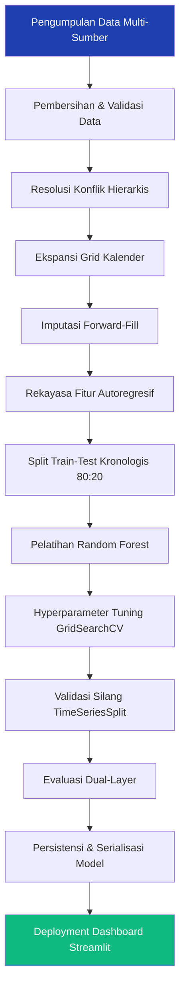

# 🏪 PANTAU PASAR

> **Prediksi Hari Ini. Persiapan Hari Esok.**

Sistem Pendukung Keputusan Prediksi Harga Komoditas Pangan menggunakan Random Forest Regressor

[](https://www.python.org/)
[](https://scikit-learn.org/)
[](https://streamlit.io/)
[](LICENSE)

---

## 📖 Gambaran Umum Proyek

Volatilitas harga pangan menjadi tantangan signifikan bagi stabilitas pasar dan kesejahteraan masyarakat, khususnya di pasar-pasar daerah di Indonesia. **PANTAU PASAR** (*Pemantauan Fluktuasi & Prediksi Harga Komoditas Pangan*) adalah sistem pendukung keputusan berbasis machine learning yang dirancang untuk memprediksi harga harian komoditas pangan di **Pasar Seketeng**, Kabupaten Sumbawa, Nusa Tenggara Barat.

Proyek ini menjawab **kesenjangan informasi kritis** yang dihadapi oleh pengelola pasar, pedagang, dan instansi pemerintah daerah yang kekurangan alat prediksi andal untuk mengantisipasi pergerakan harga. Dengan memanfaatkan **data historis 5,8 tahun** dari empat sumber heterogen (SP2KP, PIHPS, Diskoperindag Sumbawa, dan UPT Seketeng), sistem ini mengintegrasikan pipeline ETL, rekayasa fitur autoregresif, dan regresi Random Forest untuk menghasilkan **prediksi harga esok hari** dengan akurasi rata-rata **MAPE 9,34%** pada hari transaksi riil.

Sistem ini menyadari bahwa pasar tradisional beroperasi secara diskontinu (tutup saat weekend/libur), menciptakan tantangan metodologis dimana metrik evaluasi naif menjadi terlalu optimistis akibat imputasi forward-fill. Untuk mengatasi hal ini, proyek memperkenalkan **kerangka evaluasi dual-layer** yang secara terpisah menilai performa model pada hari perdagangan aktif versus periode interpolasi, memastikan pelaporan akurasi yang transparan dan genuine.

Lebih dari sekadar prediksi teknis, PANTAU PASAR berfungsi sebagai **sistem peringatan dini** untuk ketidakstabilan harga, membantu pemangku kepentingan mempersiapkan stok buffer, merencanakan intervensi pasar (*operasi pasar murah*), dan mengurangi lonjakan harga akibat spekulasi. **Dashboard interaktif Streamlit** menyediakan visualisasi intuitif untuk tren harga, profiling volatilitas, prediksi model, dan transparansi metodologis, membuat analitik canggih dapat diakses oleh pengguna non-teknis.

Penelitian ini berkontribusi sebagai baseline yang robust untuk prediksi harga pangan dalam konteks daerah berkembang dimana kualitas data, ketersediaan, dan infrastruktur menghadirkan kendala unik. Sifat open-source proyek ini mengundang pengembangan lebih lanjut melalui metode ensemble, integrasi variabel eksternal, dan ekspansi ke pasar regional lainnya.

---

## 🎯 Tujuan Proyek

- **Prediksi Harga Pangan:** Memprediksi harga komoditas esok hari dengan akurasi tinggi (MAPE < 10% untuk komoditas stabil)
- **Mendukung Pengelola Pasar:** Memberikan insight actionable untuk perencanaan inventori, alokasi buffer stock, dan timing intervensi
- **Mengurangi Ketidakpastian Harga:** Memungkinkan pedagang dan konsumen mengantisipasi pergerakan harga dan mengurangi volatilitas akibat spekulasi
- **Membangun Dashboard Interaktif:** Deploy antarmuka berbasis web yang mudah diakses untuk monitoring dan prediksi real-time
- **Meningkatkan Pengambilan Keputusan:** Mengubah data historis menjadi intelijen strategis untuk kebijakan ketahanan pangan pemerintah daerah
- **Membangun Model Baseline:** Menciptakan framework yang reproducible untuk prediksi time-series di pasar pangan regional

---

## 🔄 Alur Kerja Proyek



---

## 🛠️ Teknologi yang Digunakan

| Teknologi | Tujuan Penggunaan | Versi |
|-----------|-------------------|-------|
| **Python** | Bahasa pemrograman utama | 3.12+ |
| **pandas** | Manipulasi data dan ETL | 2.0+ |
| **NumPy** | Komputasi numerik | 1.24+ |
| **scikit-learn** | Machine learning (Random Forest, metrik) | 1.3+ |
| **Plotly** | Visualisasi interaktif | 5.18+ |
| **Matplotlib** | Plotting statistik | 3.7+ |
| **Seaborn** | Visualisasi data statistik | 0.12+ |
| **Streamlit** | Framework dashboard interaktif | 1.30+ |
| **Jupyter Notebook** | Analisis data eksploratori (EDA) | - |
| **Git/GitHub** | Version control dan kolaborasi | - |

---

## 📁 Struktur Proyek

```
PANTAU-PASAR/
│
├── data_set/                          # Data mentah dari berbagai sumber
│   ├── SP2KP/                         # Data Kementerian Perdagangan (Prioritas 1)
│   ├── PIHPS/                         # Portal Harga Nasional (Prioritas 4)
│   ├── Diskoperindag Sumbawa/        # Data Pemda (Prioritas 2)
│   └── UPT Seketeng/                  # Data Unit Pasar (Prioritas 3)
│
├── processed_data/                    # Dataset yang telah dibersihkan dan ditransformasi
│   ├── cleaned/                       # Dataset pasca-cleaning
│   ├── merged/                        # Setelah resolusi konflik hierarkis
│   │   └── dataset_all_merged.csv
│   └── features/                      # Fitur yang sudah direkayasa
│       └── features_all_dataset.csv
│
├── notebook/                          # Jupyter notebooks (pipeline analisis)
│   ├── cleaning.ipynb                 # Pembersihan & validasi data
│   ├── merge_dataset.ipynb            # Integrasi multi-sumber
│   ├── preprocessing.ipynb            # Ekspansi grid kalender
│   ├── feature_engineering.ipynb      # Pembuatan fitur autoregresif
│   ├── eda.ipynb                      # Exploratory Data Analysis
│   ├── modelling.ipynb                # Pelatihan & tuning model
│   ├── evaluation_model.ipynb         # Evaluasi dual-layer
│   └── data_visualization_and_explanatory.ipynb  # Visualisasi
│
├── models/                            # Artifact model terlatih
│   ├── model_rf.pkl                   # Model Random Forest terserialisasi
│   ├── training_metadata.json         # Hyperparameter & metrik
│   ├── feature_columns.json           # Nama-nama fitur
│   └── split_info.json                # Metadata split train-test
│
├── results/                           # Output evaluasi
│   ├── evaluation_per_commodity.csv   # Performa 23 komoditas
│   ├── feature_importance.csv         # Ranking kontribusi fitur
│   ├── test_predictions.csv           # Prediksi model pada test set
│   └── evaluation_summary.json        # Metrik keseluruhan
│
├── dashboard/                         # Aplikasi web Streamlit
│   ├── app.py                         # Entry point dashboard
│   ├── pages/                         # Halaman multi-page
│   │   ├── 1_Overview.py              # Ringkasan eksekutif
│   │   ├── 2_Analisis_EDA.py          # Eksplorasi mendalam
│   │   ├── 3_Prediksi_Harga.py        # Inferensi model ML
│   │   ├── 4_Perbandingan.py          # Komparasi komoditas
│   │   └── 5_Metodologi.py            # Dokumentasi akademis
│   └── utils/                         # Utility modules
│       ├── data_loader.py             # Fungsi loading data
│       └── visualization.py           # Helper visualisasi
│
├── figures/                           # Grafik dan plot ekspor
├── requirements.txt                   # Dependensi Python
├── .gitignore                         # File yang diabaikan Git
└── README.md                          # Dokumentasi proyek (file ini)
```

---

## 📊 Kamus Data

| Fitur | Tipe Data | Deskripsi | Peran |
|-------|-----------|-----------|-------|
| **Tanggal** | DateTime | Tanggal observasi (2021-01-18 s/d 2026-11-10) | Index Temporal |
| **Komoditas** | Categorical | Nama komoditas pangan (57 unik) | Identifier |
| **Harga** | Float | Harga pasar dalam Rupiah | **Target Prediksi** |
| **Sumber** | Categorical | Asal data (SP2KP, PIHPS, Diskoperindag, UPT) | Metadata |
| **Harga_Kemarin** | Float | Lag-1: Harga 1 hari sebelumnya | **Fitur Utama** (83,3%) |
| **Harga_Minggu_Lalu** | Float | Lag-7: Harga 7 hari sebelumnya | Fitur Lag |
| **Rolling_Mean_7** | Float | Rata-rata bergerak 7 hari | Fitur Rolling |
| **Rolling_Mean_14** | Float | Rata-rata bergerak 14 hari | Fitur Rolling |
| **Rolling_Std_7** | Float | Standar deviasi 7 hari | Fitur Volatilitas |
| **Rolling_Max_7** | Float | Harga maksimum 7 hari | Fitur Range |
| **Rolling_Min_7** | Float | Harga minimum 7 hari | Fitur Range |
| **Tahun** | Integer | Tahun (2021-2026) | Fitur Kalender |
| **Bulan** | Integer | Bulan (1-12) | Fitur Kalender |
| **Hari** | Integer | Hari dalam bulan (1-31) | Fitur Kalender |
| **DayOfWeek** | Integer | Hari dalam minggu (0=Senin, 6=Minggu) | Fitur Kalender |
| **Quarter** | Integer | Kuartal (1-4) | Fitur Kalender |
| **WeekOfYear** | Integer | Minggu dalam tahun (1-53) | Fitur Kalender |

> **Catatan:** Fitur kalender berkontribusi minimal (<0,01%) karena seasonality lemah pada level harian. Event-driven spikes (Ramadan, Tahun Baru) tidak tertangkap oleh fitur kalender sederhana.

---

## 🔬 Pipeline Machine Learning

### 1️⃣ Pengumpulan Data

**Sumber Data Heterogen:**
- **SP2KP** (Sistem Pemantauan Pasar dan Kebutuhan Pokok): 24.445 baris, format wide dengan 2 baris metadata
- **PIHPS** (Portal Informasi Harga Pangan Strategis): 20.940 baris, tanggal dengan spasi
- **Diskoperindag Sumbawa**: 7.963 baris, 2 layout berbeda
- **UPT Seketeng** (Unit Pelaksana Teknis Pasar): 601 baris, format long dengan tanggal kurung siku

**Total Data Mentah:** 53.949 baris

---

### 2️⃣ Pembersihan & Integrasi Data

**Resolusi Konflik Hierarkis:**

Ketika kombinasi `(Tanggal, Komoditas)` yang sama muncul di multiple sumber, sistem menggunakan prioritas:

1. **SP2KP** (Prioritas 1 - Nasional Utama)
2. **Diskoperindag** (Prioritas 2 - Lokal Resmi)
3. **UPT Seketeng** (Prioritas 3 - Lapangan)
4. **PIHPS** (Prioritas 4 - Pembanding)

**Hasil:** 39.601 baris (deduplikasi -26,6%)

---

### 3️⃣ Preprocessing

**Ekspansi Grid Kalender:**

Model time series membutuhkan data kontinu setiap hari untuk fitur lag/rolling. Data mentah hanya berisi hari trading (weekend/libur = missing).

```
Master Kalender (2021-01-01 → 2026-11-10) = 2.140 hari
    × 57 Komoditas Unik
    = 121.980 baris grid
    ↓ Left Join dengan data gabungan
    → preprocessed_dataset.csv
```

**Imputasi Forward-Fill per Komoditas:**

Missing values pada hari non-trading diisi dengan harga hari terakhir (pasar tutup = harga tidak berubah).

---

### 4️⃣ Rekayasa Fitur (Feature Engineering)

**13 Fitur Temporal:**

| Kategori | Fitur | Kontribusi | Deskripsi |
|----------|-------|------------|-----------|
| **Lag** (2) | Harga_Kemarin | **83,29%** | shift(1) - Prediktor dominan |
| | Harga_Minggu_Lalu | 1,36% | shift(7) |
| **Rolling** (5) | Rolling_Mean_7 | 4,79% | rolling(7).mean() |
| | Rolling_Mean_14 | 4,08% | rolling(14).mean() |
| | Rolling_Std_7 | 0,003% | rolling(7).std() |
| | Rolling_Max_7 | 3,49% | rolling(7).max() |
| | Rolling_Min_7 | 2,98% | rolling(7).min() |
| **Kalender** (6) | Tahun, Bulan, Hari, DayOfWeek, Quarter, WeekOfYear | <0,01% | Seasonality lemah |

**Formula Rolling (Anti-Leakage):**
```python
Rolling_Mean_7[t] = mean(Harga[t-7 : t-1])  # Window di-shift 1 hari
Rolling_Std_7[t] = std(Harga[t-7 : t-1])
```

**Output:** 76.363 baris (setelah dropna untuk window lag/rolling)

---

### 5️⃣ Split Data

**Strategi:** Chronological 80:20 Split (TANPA random shuffle)

| Set | Baris | Persentase | Rentang Tanggal |
|-----|-------|------------|-----------------|
| **Train** | 61.087 | 80,0% | 2021-01-18 → 2026-02-15 |
| **Test** | 15.276 | 20,0% | 2026-02-16 → 2026-11-10 |

> **Guard Check:** `test['Tanggal'].min() > train['Tanggal'].max()` ✅ **PASS** (mencegah future leakage)

---

### 6️⃣ Pelatihan Model

**Algoritma:** Random Forest Regressor (scikit-learn)

**Alasan Pemilihan:**
- ✅ Menangani hubungan non-linear
- ✅ Robust terhadap outliers (spike cabai, tomat)
- ✅ Built-in feature importance (interpretability)
- ✅ Tidak ada asumsi distribusi data
- ✅ Parallel training (n_jobs=-1)

**Hyperparameter (Tuned via GridSearchCV):**

| Parameter | Nilai | Keterangan |
|-----------|-------|------------|
| `n_estimators` | 100 | Jumlah decision trees dalam ensemble |
| `max_depth` | 10 | Kedalaman maksimum setiap tree |
| `min_samples_split` | 12 | Minimum sampel untuk split internal node |
| `min_samples_leaf` | 5 | Minimum sampel di leaf node |
| `random_state` | 42 | Seed untuk reproducibility |
| `n_jobs` | -1 | Parallel processing (semua CPU cores) |

**Validasi:** TimeSeriesSplit (5 folds) - expanding window untuk mencegah future leakage

**Best CV MAE:** Rp 1.107,96

---

### 7️⃣ Evaluasi Model

**Metodologi Dual-Layer (Kontribusi Penelitian):**

Test set terdiri dari 2 jenis baris dengan karakteristik berbeda:

| Layer | Jumlah | % | Karakteristik | MAPE |
|-------|--------|---|---------------|------|
| **Layer 1: Global (Dengan FFill)** | 14.847 | 97,2% | Harga = Harga_Kemarin (pasar tutup) | 0,56% ⚠️ Over-optimistic |
| **Layer 2: Hari Transaksi Riil** | 429 | 2,8% | Harga ≠ Harga_Kemarin (pasar aktif) | **9,34%** ✅ Genuine |

**Metrik Evaluasi Layer 2 (Hari Riil):**

| Metrik | Nilai | Interpretasi |
|--------|-------|--------------|
| **MAE** | Rp 3.599 | Rata-rata error absolut |
| **RMSE** | Rp 4.892 | Penalti lebih besar untuk error ekstrem |
| **MAPE** | **9,34%** | **Kategori "Sangat Baik"** (< 10%) |
| **R² Score** | 0,941 | Model menjelaskan 94,1% variance |

**Perbandingan dengan Naive Baseline:**

Model Random Forest mengalahkan naive baseline (prediksi = Harga_Kemarin) di **17 dari 23 komoditas** (73,9%).

---

## 📈 Hasil Evaluasi Per-Komoditas

**23 Komoditas Memenuhi Threshold** (minimal 5 hari transaksi riil di test set):

| Rank | Komoditas | MAPE | Kategori | Lebih Baik dari Baseline |
|------|-----------|------|----------|--------------------------|
| 1 | Daging Ayam Ras | 3,43% | ⭐ Sangat Baik | ✅ |
| 2 | Minyak Goreng Sawit Curah | 3,49% | ⭐ Sangat Baik | ✅ |
| 3 | Telur Ayam Ras | 4,02% | ⭐ Sangat Baik | ✅ |
| 4 | Beras Medium | 4,35% | ⭐ Sangat Baik | ✅ |
| 5 | Beras Premium | 4,59% | ⭐ Sangat Baik | ✅ |
| 6 | Gula Pasir Curah | 5,23% | ⭐ Sangat Baik | ✅ |
| 7 | Udang Basah | 6,96% | ⭐ Sangat Baik | ✅ |
| 8 | Minyak Goreng Sawit Kemasan Premium | 7,63% | ⭐ Sangat Baik | ❌ |
| 9 | Kedelai Lokal | 7,64% | ⭐ Sangat Baik | ❌ |
| 10 | Bawang Putih Honan | 7,96% | ⭐ Sangat Baik | ❌ |
| 11 | Bawang Merah | 9,36% | ⭐ Sangat Baik | ❌ |
| 12 | Kacang Hijau | 9,37% | ⭐ Sangat Baik | ✅ |
| 13 | Kacang Tanah | 10,36% | ✅ Baik | ❌ |
| 14 | Cabai Merah Keriting | 11,44% | ✅ Baik | ✅ |
| 15 | Tomat | 11,51% | ✅ Baik | ✅ |
| 16 | Ikan Kembung | 12,18% | ✅ Baik | ✅ |
| 17 | Cabai Merah Besar | 12,72% | ✅ Baik | ❌ |
| 18 | Cabai Rawit Hijau | 13,49% | ✅ Baik | ✅ |
| 19 | Cabai Rawit Merah | 13,96% | ✅ Baik | ✅ |
| 20 | Minyakita | 14,85% | ✅ Baik | ✅ |
| 21 | Ikan Bandeng | 15,70% | ✅ Baik | ✅ |
| 22 | Ikan Tongkol | 17,12% | ✅ Baik | ✅ |
| 23 | Jagung Pipilan Kuning | 19,32% | ✅ Baik | ✅ |

**Ringkasan Kategori MAPE:**
- **12 komoditas** (52,2%) → **Sangat Baik** (MAPE < 10%)
- **11 komoditas** (47,8%) → **Baik** (MAPE 10-20%)
- **0 komoditas** → Cukup atau Buruk (MAPE ≥ 20%)

> **Catatan:** 34 komoditas lainnya tidak memenuhi threshold evaluasi (<5 hari transaksi riil di test set).

---

## 🎨 Fitur Dashboard

Dashboard **PANTAU PASAR** menyediakan 5 modul interaktif:

### 1️⃣ Overview - Ringkasan Eksekutif
- **KPI Utama:** Total komoditas, data records, akurasi model, rentang waktu
- **Proporsi Kontribusi Sumber Data:** Pie chart & bar chart interaktif
- **Mekanisme Hierarki Resolusi:** Dokumentasi prioritas sumber data

### 2️⃣ Analisis EDA - Eksplorasi Mendalam
- **Tren Harga Historis:** Line chart interaktif dengan range selector
- **Statistik Deskriptif:** Mean, median, std, min, max per komoditas
- **Distribusi Harga:** Histogram dan box plot
- **Korelasi Temporal:** Autocorrelation analysis

### 3️⃣ Prediksi Harga - Inferensi Model ML
- **Dual-Layer Metrics:** Toggle antara evaluasi riil vs global
- **Visualisasi Prediksi:** Actual vs Predicted line chart
- **Feature Importance:** Top 10 fitur terpenting
- **Per-Commodity Evaluation:** Tabel 23 komoditas dengan performa detail

### 4️⃣ Perbandingan - Komparasi Komoditas
- **Multi-Commodity Chart:** Bandingkan hingga 5 komoditas sekaligus
- **Volatility Profiling:** Ranking komoditas berdasarkan CV (%)
- **Price Range Analysis:** Min-max comparison
- **Correlation Heatmap:** Korelasi antar komoditas

### 5️⃣ Metodologi - Dokumentasi Akademis
- **Pipeline Data:** ETL flow dan resolusi konflik
- **Feature Engineering:** Formula dan rasional fitur
- **Model Architecture:** Hyperparameter dan training process
- **Dual-Layer Evaluation:** Penjelasan metodologi baru
- **Limitasi & Rekomendasi:** Transparansi penelitian

---

## 🚀 Instalasi & Menjalankan Proyek

### Prasyarat

- Python 3.12 atau lebih tinggi
- pip (Python package manager)
- Git

### Langkah Instalasi

1. **Clone Repository**

```bash
git clone https://github.com/username/pantau-pasar.git
cd pantau-pasar
```

2. **Buat Virtual Environment (Opsional tapi Disarankan)**

```bash
# Windows
python -m venv venv
venv\Scripts\activate

# Linux/Mac
python3 -m venv venv
source venv/bin/activate
```

3. **Install Dependencies**

```bash
pip install -r requirements.txt
```

4. **Verifikasi Struktur Data**

Pastikan folder berikut ada dan berisi data:
- `processed_data/features/features_all_dataset.csv`
- `processed_data/merged/dataset_all_merged.csv`
- `results/evaluation_per_commodity.csv`
- `models/model_rf.pkl`

5. **Jalankan Dashboard**

```bash
cd dashboard
streamlit run app.py
```

Dashboard akan terbuka di browser pada `http://localhost:8501`

---

### Menjalankan Notebook Jupyter

```bash
jupyter notebook
```

Buka notebook dalam urutan pipeline:
1. `cleaning.ipynb`
2. `merge_dataset.ipynb`
3. `preprocessing.ipynb`
4. `feature_engineering.ipynb`
5. `eda.ipynb`
6. `modelling.ipynb`
7. `evaluation_model.ipynb`

---

## 💡 Hasil yang Diharapkan

### Untuk Pengelola Pasar & Pemerintah Daerah
- **Prediksi Akurat:** Estimasi harga esok hari dengan MAPE <10% untuk komoditas stabil
- **Sistem Peringatan Dini:** Deteksi komoditas dengan volatilitas tinggi (CV >30%) untuk intervensi proaktif
- **Dukungan Keputusan:** Data-driven insights untuk operasi pasar murah dan buffer stock allocation
- **Monitoring Real-time:** Dashboard interaktif untuk memantau tren harga dan anomali

### Untuk Pedagang & Pelaku Usaha
- **Perencanaan Stocking:** Antisipasi harga untuk optimasi pembelian grosir
- **Manajemen Risiko:** Identifikasi periode volatilitas tinggi (Ramadan, Tahun Baru)
- **Competitive Intelligence:** Benchmark harga dengan historical average dan proyeksi

### Untuk Masyarakat & Konsumen
- **Transparansi Harga:** Akses informasi harga historis dan proyeksi
- **Waktu Pembelian Optimal:** Identifikasi timing terbaik untuk pembelian komoditas tertentu
- **Kesadaran Inflasi:** Pemahaman tren inflasi pangan lokal

### Untuk Peneliti & Akademisi
- **Baseline Reproducible:** Framework open-source untuk prediksi harga pangan regional
- **Metodologi Inovatif:** Dual-layer evaluation sebagai kontribusi metodologis
- **Dataset Benchmark:** Data 5,8 tahun untuk penelitian lanjutan
- **Foundation untuk Enhancement:** Platform untuk ensemble methods, external variables, deep learning

---

## 🎓 Kesimpulan Proyek

Proyek **PANTAU PASAR** berhasil membangun sistem prediksi harga pangan yang andal untuk Pasar Seketeng, Kabupaten Sumbawa, dengan mengintegrasikan data heterogen dari empat sumber berbeda melalui pipeline ETL yang robust. Implementasi Random Forest Regressor dengan autoregressive feature engineering menghasilkan akurasi prediksi **MAPE 9,34%** pada hari transaksi riil, menempatkan model dalam kategori "Sangat Baik" menurut standar akademis.

Kontribusi metodologis utama penelitian ini adalah pengenalan **kerangka evaluasi dual-layer** yang secara transparan membedakan performa model pada hari perdagangan aktif versus periode forward-fill, mengatasi bias evaluasi yang umum terjadi pada dataset time-series dengan missing values struktural. Dari 23 komoditas yang dievaluasi, 52,2% mencapai kategori "Sangat Baik" (MAPE <10%) dan seluruh komoditas berada dalam kategori "Baik" atau lebih baik (MAPE <20%), menunjukkan konsistensi prediksi lintas berbagai jenis pangan.

Analisis feature importance mengkonfirmasi hipotesis autoregressive dengan `Harga_Kemarin` berkontribusi 83,29% terhadap prediksi, sejalan dengan karakteristik pasar tradisional dimana harga hari ini sangat dipengaruhi harga kemarin. Temuan ini mengindikasikan bahwa pendekatan lag-based forecasting lebih efektif dibanding seasonality modeling untuk konteks pasar harian regional.

Dashboard interaktif Streamlit yang telah dideploy menjembatani kesenjangan antara kompleksitas teknis machine learning dengan kebutuhan praktis pengguna non-teknis, memberikan akses demokratis terhadap analitik prediktif untuk pengelola pasar, pedagang, dan pembuat kebijakan. Sistem ini tidak hanya berfungsi sebagai alat prediksi, tetapi juga sebagai platform edukasi dan transparansi informasi pasar.

Meskipun demikian, penelitian ini memiliki limitasi yang membuka peluang pengembangan lebih lanjut, termasuk: (1) belum mengintegrasikan variabel eksternal seperti cuaca, harga BBM, dan inflasi nasional, (2) seasonality modeling yang masih sederhana, (3) horizon prediksi terbatas pada 1 hari ke depan, dan (4) cakupan geografis yang terbatas pada satu pasar. Rekomendasi untuk penelitian lanjutan mencakup eksplorasi ensemble methods (stacking RF dengan XGBoost/LightGBM), implementasi deep learning (LSTM/Transformer), integrasi API real-time, dan ekspansi ke multiple markets dengan hierarchical modeling.

Secara keseluruhan, PANTAU PASAR membuktikan bahwa teknologi machine learning dapat diaplikasikan secara efektif dalam konteks ketahanan pangan daerah, bahkan dengan keterbatasan infrastruktur data dan kompleksitas pasar tradisional. Proyek ini menyediakan foundation yang solid untuk digitalisasi dan modernisasi sistem informasi pasar di Indonesia.

---

## 🔮 Pengembangan Masa Depan

### 🤖 Peningkatan Model

- [ ] **Ensemble Methods**
  - Stacking: RF + XGBoost + LightGBM + Linear Regression (meta-learner)
  - Voting Regressor dengan weighted average berdasarkan per-commodity MAPE
  - Blend predictions dari multiple models untuk reduce variance

- [ ] **Deep Learning**
  - LSTM/GRU untuk menangkap long-term dependencies (>14 hari)
  - Temporal Fusion Transformer (TFT) dengan attention mechanism
  - Prophet (Facebook) untuk seasonality decomposition otomatis

- [ ] **Hierarchical Modeling**
  - Model global → model per-cluster komoditas (volatile vs stable)
  - Separate models untuk komoditas dengan karakteristik berbeda
  - Per-market models jika ekspansi ke pasar lain (Bima, Lombok)

- [ ] **Uncertainty Quantification**
  - Confidence intervals untuk prediksi (quantile regression)
  - Probabilistic forecasting dengan Bayesian approaches
  - Monte Carlo dropout untuk uncertainty estimation

### 📊 Augmentasi Fitur

- [ ] **Variabel Eksternal**
  - Cuaca: Suhu, curah hujan → pengaruh supply sayuran (cabai, tomat)
  - Harga BBM: Cost produksi dan transportasi
  - Inflasi Nasional: Purchasing power masyarakat
  - Sentimen Berita: Scraping berita ekonomi → sentiment analysis

- [ ] **Calendar Events**
  - Binary flags: `is_ramadan`, `is_tahun_baru`, `is_idul_fitri`
  - Days-until-event: `days_to_ramadan` (countdown feature)
  - Day-after-event: `days_after_idul_fitri` (demand normalization)
  - Public holidays calendar integration

- [ ] **Spatial Features**
  - Harga komoditas di kabupaten tetangga (Bima, Dompu, Lombok)
  - Distance to production center (km dari sentra produksi)
  - Supply volume data (jika tersedia dari dinas pertanian)
  - Inter-market price correlation features

### 🗄️ Pengumpulan Data

- [ ] **Frekuensi Lebih Tinggi**
  - Real-time intraday (pagi vs sore) → capture daily volatility
  - Differentiate weekday vs weekend (beberapa kios buka weekend)
  - Hourly data untuk komoditas sangat volatile (cabai, tomat)

- [ ] **Granularitas Lebih Detail**
  - Varietas spesifik: Beras IR-64 vs Ciherang vs Slyp
  - Grade kualitas: A, B, C untuk protein (ayam, telur)
  - Ukuran/berat standar: Cabai rawit kualitas super vs biasa

- [ ] **Coverage Geografis**
  - Pasar-pasar kecamatan (bukan hanya Seketeng)
  - Retail modern (supermarket, minimarket) → price comparison
  - Sentra produksi langsung (petani, peternak)
  - E-commerce platforms (Tokopedia, Shopee)

### 🚀 Deployment & Integrasi

- [ ] **API Service**
  - RESTful API untuk integrasi third-party (POS, e-commerce)
  - Batch prediction endpoint untuk policy simulation
  - WebSocket untuk real-time streaming predictions
  - Authentication & rate limiting

- [ ] **Mobile Application**
  - Push notification untuk trader (harga prediksi besok pagi)
  - Price tracking per komoditas favorit (watchlist)
  - QR code scanner untuk check harga real-time vs prediksi
  - Offline mode dengan local caching

- [ ] **Cloud Deployment**
  - Containerization dengan Docker
  - Orchestration dengan Kubernetes
  - Auto-scaling based on traffic
  - Multi-region deployment untuk low latency

- [ ] **MLOps Pipeline**
  - Model performance drift detection (MAPE naik >15%)
  - Automated retraining pipeline (monthly/quarterly)
  - A/B testing untuk model baru vs production model
  - Version control dengan MLflow/DVC
  - Continuous monitoring & alerting

### 🧪 Eksperimen Lanjutan

- [ ] **Anomaly Detection**
  - Isolation Forest untuk deteksi price spikes ekstrem
  - LSTM Autoencoder untuk pattern anomaly
  - Alert system untuk harga >2σ dari moving average

- [ ] **Explainable AI**
  - SHAP values untuk interpretasi prediksi individual
  - LIME untuk local explanation
  - Partial Dependence Plots (PDP) untuk feature interaction

- [ ] **Multi-Horizon Forecasting**
  - 1-day, 3-day, 7-day, 14-day predictions
  - Iterative forecasting dengan confidence degradation
  - Evaluate accuracy degradation over horizon

- [ ] **Transfer Learning**
  - Pre-train model di pasar lain (Jakarta, Surabaya)
  - Fine-tune untuk Pasar Seketeng dengan limited data
  - Domain adaptation techniques

---

## 🤝 Kontribusi

Kontribusi sangat diterima! Jika Anda ingin berkontribusi pada proyek ini:

1. **Fork** repository ini
2. Buat **branch** fitur baru (`git checkout -b feature/AmazingFeature`)
3. **Commit** perubahan Anda (`git commit -m 'Add some AmazingFeature'`)
4. **Push** ke branch (`git push origin feature/AmazingFeature`)
5. Buat **Pull Request**

### Area Kontribusi

- 🐛 Bug fixes dan error handling
- 📊 Visualisasi tambahan di dashboard
- 🤖 Implementasi model alternatif (XGBoost, LSTM, Prophet)
- 📝 Dokumentasi dan tutorial
- 🧪 Unit testing dan integration testing
- 🌐 Internasionalisasi (i18n) dashboard
- 📱 Mobile app development
- ☁️ Cloud deployment scripts

### Pedoman Kontribusi

- Ikuti PEP 8 untuk Python code style
- Tulis docstrings untuk fungsi dan class
- Tambahkan unit tests untuk fitur baru
- Update README jika menambahkan fitur major
- Gunakan commit message yang deskriptif

---

## 📄 Lisensi

Proyek ini dilisensikan di bawah **MIT License** - lihat file [LICENSE](LICENSE) untuk detail.

```
MIT License

Copyright (c) 2026 Saputra Budiman

Permission is hereby granted, free of charge, to any person obtaining a copy
of this software and associated documentation files (the "Software"), to deal
in the Software without restriction, including without limitation the rights
to use, copy, modify, merge, publish, distribute, sublicense, and/or sell
copies of the Software, and to permit persons to whom the Software is
furnished to do so, subject to the following conditions:

The above copyright notice and this permission notice shall be included in all
copies or substantial portions of the Software.
```

---

## 👨‍💻 Penulis & Kontak

**Saputra Budiman**  
Sistem Informasi Manajemen  
Universitas [Nama Universitas]

- 📧 Email: [email@example.com](mailto:email@example.com)
- 🐙 GitHub: [@username](https://github.com/username)
- 💼 LinkedIn: [Saputra Budiman](https://linkedin.com/in/username)

---

## 🙏 Acknowledgments

Terima kasih kepada:

- **Kementerian Perdagangan RI** (SP2KP) - Penyediaan data nasional
- **PIHPS** - Portal informasi harga pangan strategis
- **Diskoperindag Kabupaten Sumbawa** - Data lokal dan dukungan penelitian
- **UPT Pasar Seketeng** - Data lapangan dan akses ke pasar
- **Dosen Pembimbing** - Guidance dan arahan penelitian
- **Streamlit Community** - Framework dashboard yang luar biasa
- **Scikit-learn Contributors** - Library machine learning yang robust
- **Open Source Community** - Inspirasi dan tools yang digunakan

---

## 📚 Referensi & Sitasi

Jika Anda menggunakan proyek ini dalam penelitian atau publikasi, mohon sitasi:

```bibtex
@thesis{budiman2026pantaupasar,
  title={Sistem Pendukung Keputusan Prediksi Harga Komoditas Pangan 
         Menggunakan Random Forest Regressor dengan Dual-Layer Evaluation},
  author={Budiman, Saputra},
  year={2026},
  school={[Nama Universitas]},
  type={Skripsi Sarjana},
  address={Sumbawa, Indonesia},
  note={Available at: https://github.com/username/pantau-pasar}
}
```

### Publikasi Terkait

- TODO: Tambahkan publikasi jika ada

### Dataset

Data yang digunakan dalam penelitian ini berasal dari sumber-sumber publik:
- SP2KP: https://ews.kemendag.go.id/sp2kp-landing
- PIHPS: https://hargapangan.id/
- Diskoperindag & UPT: Data internal dengan izin penelitian

---

## 📊 Status Proyek


**Last Updated:** Juni 2026

---

## 🌟 Star History

Jika proyek ini bermanfaat, berikan ⭐ di GitHub!

---

[⬆ Kembali ke Atas](#-pantau-pasar)

</div>
